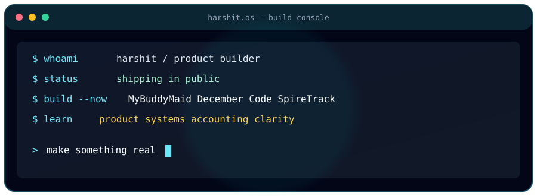
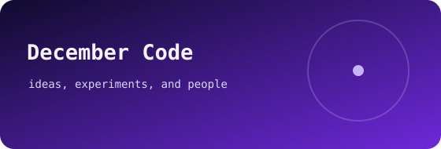
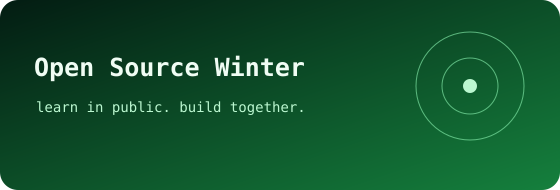
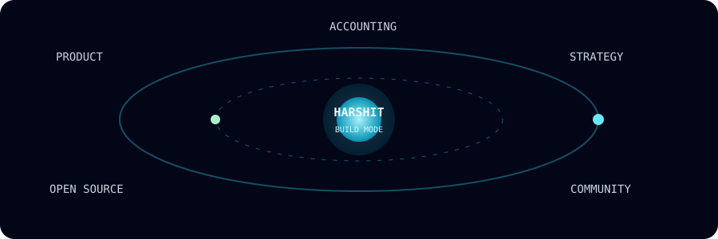
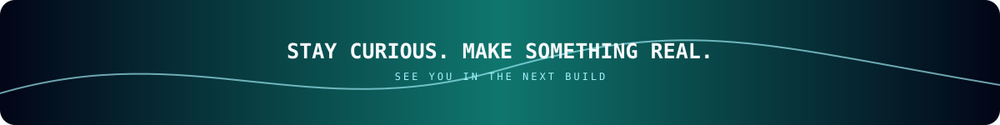

---

## ⚡ About

I take ideas from a blank page to something real, useful, and a little unexpected. I'm building products, growing communities, and learning the business side of making good things last.

- 🔨 **Building:** MyBuddyMaid, December Code, SpireTrack
- 📚 **Learning:** product strategy, accounting, making ideas clearer
- 🌱 **Running:** Open Source Winter

## 🚀 What I'm building

<table>
	<tr>
		<td width="50%"></td>
		<td width="50%"></td>
	</tr>
	<tr>
		<td width="50%"></td>
		<td width="50%"></td>
	</tr>
</table>

More in my [repositories](https://github.com/harshitkrhere?tab=repositories).

## 🧩 What I orbit

## 📊 GitHub activity

  

  

